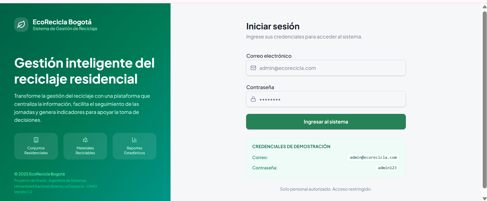
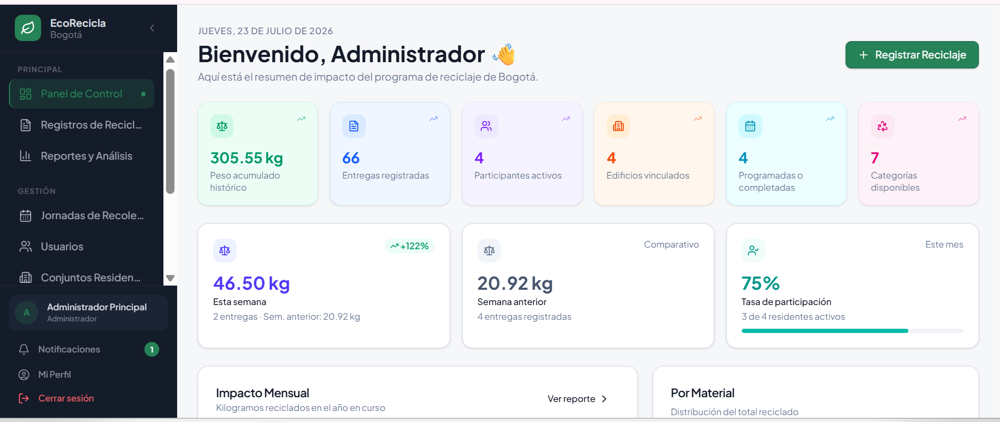
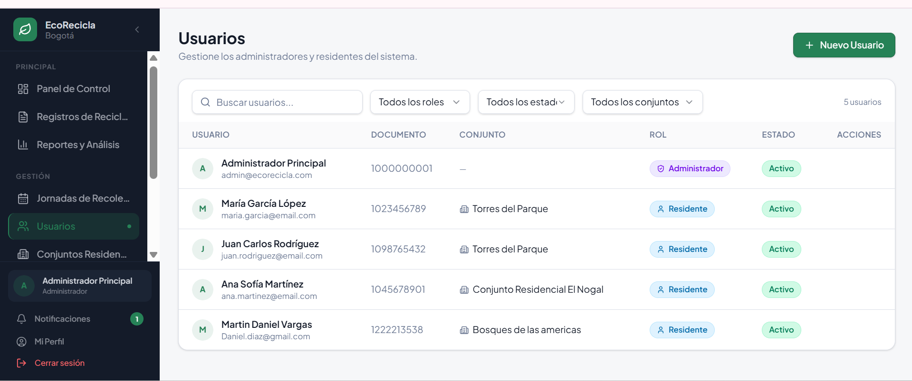
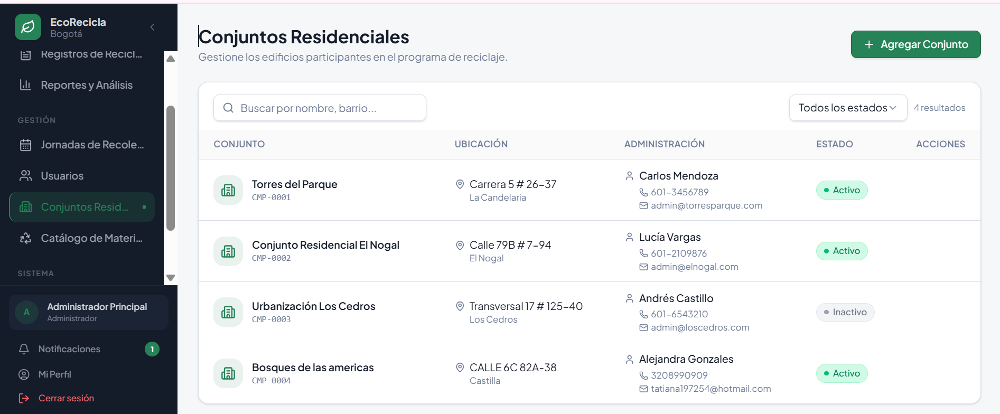
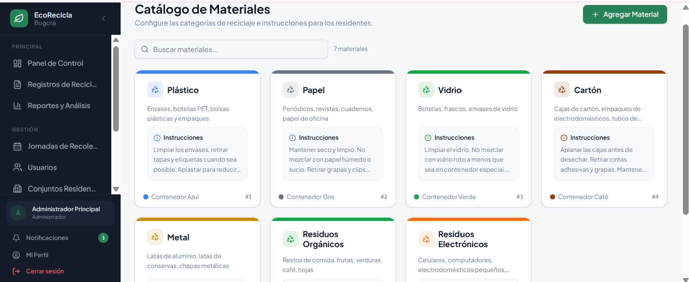
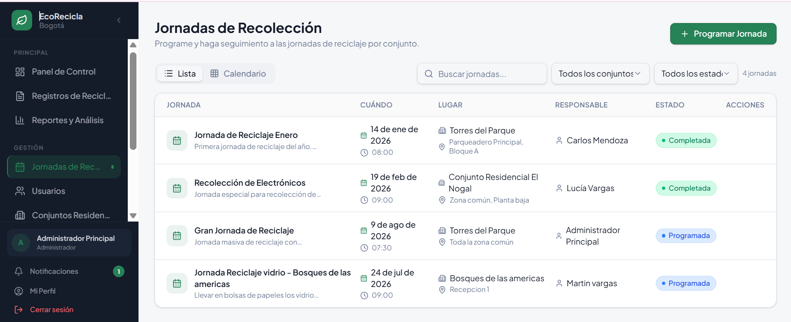
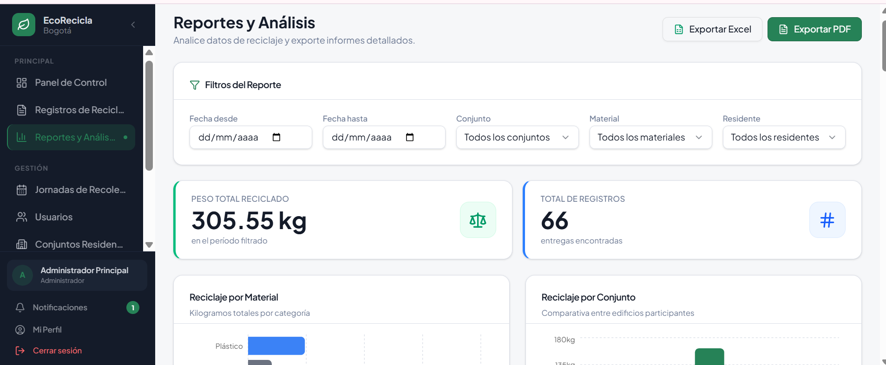
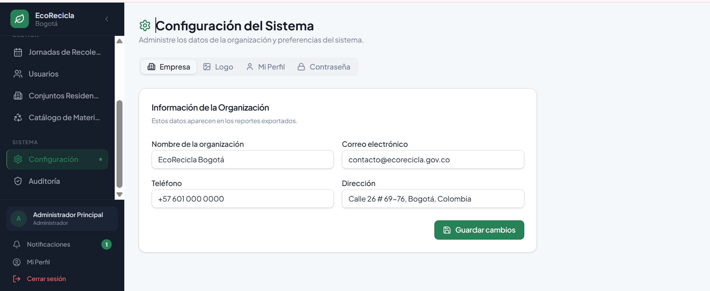
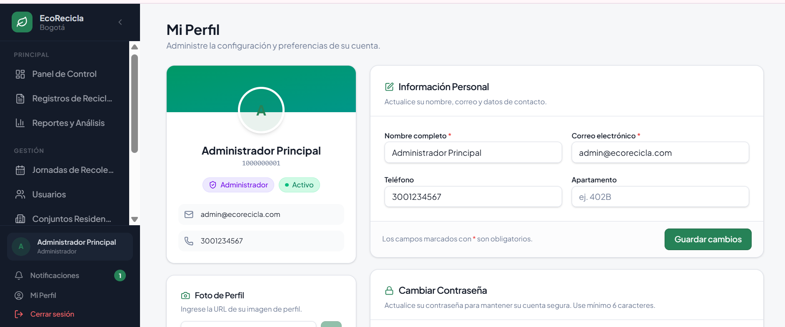
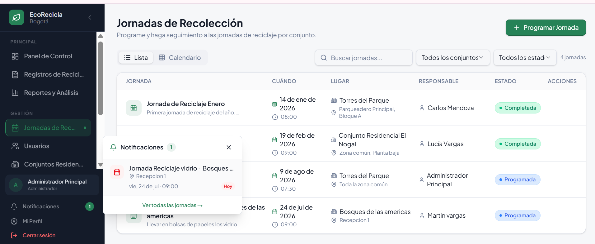

# EcoRecicla Bogotá

Apicacion web para la gestión del reciclaje en conjuntos residenciales de Bogotá.
Proyecto de grado de Ingeniería de Sistemas
Universidad Nacional Abierta y a Distancia – UNAD.

## Ver el proyecto

### Aplicación en línea
https://ecorecicla-bogota.replit.app

### Repositorio
Si desea revisar la implementación, la estructura del proyecto o el código desarrollado, puede acceder al repositorio en GitHub
https://github.com/tatianadiaz2816-hub/EcoRecicla-Bogota

## ¿Cómo probar la aplicación?

1. Ingrese a la aplicación desde el enlace anterior.
2. Utilice las credenciales de demostración que aparecen en la pantalla de inicio de sesión.
3. Explore los diferentes módulos del sistema:
   - Panel de control
   - Usuarios
   - Conjuntos residenciales
   - Materiales reciclables
   - Jornadas de recolección
   - Reportes y análisis
   - Configuración
   - Perfil y notificaciones

## Funcionalidades principales

- Gestión de usuarios.
- Gestión de conjuntos residenciales.
- Registro de reciclaje.
- Catálogo de materiales.
- Programación de jornadas.
- Dashboard con indicadores.
- Reportes estadísticos.
- Exportación a PDF y Excel.
- Diseño responsive.

## Tecnologías utilizadas
- React
- TypeScript
- Node.js
- PostgreSQL
- CSS
- Git
- GitHub
## Arquitectura
- Frontend: React + TypeScript
- Backend: Express
- Base de datos: PostgreSQL
- Comunicación mediante API REST

# Capturas del sistema

(Aquí dejas todas las imágenes que ya agregaste)

---

## Autora

**Julieth Tatiana Vanegas Díaz**

Ingeniería de Sistemas

Universidad Nacional Abierta y a Distancia – UNAD
# Capturas del sistema
## Inicio de sesión

## Panel de control

## Usuarios

## Conjuntos residenciales

## Catálogo de materiales

## Jornadas de recolección

## Reportes y análisis

## Configuración

## Mi perfil

## Notificaciones

